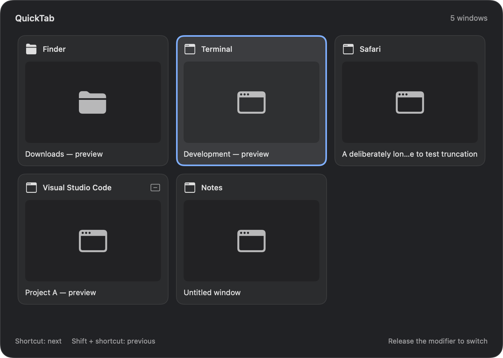

# QuickTab

QuickTab is an open-source macOS window switcher for people who work across many windows. It runs in the menu bar and uses public Accessibility, AppKit, SwiftUI, Core Graphics, and ScreenCaptureKit APIs.



## Features

- Fast keyboard switching between individual application windows.
- Configurable Option, Control, or Command shortcut and key.
- MRU ordering based on real focus changes.
- Shift reverse cycling, Escape cancellation, and exact-window activation.
- Optional thumbnails with bounded cache and safe placeholders.
- Native dark overlay, menu-bar settings, app icon, and drag-and-drop DMG.
- No external runtime dependencies and no private APIs.

## Requirements

- macOS 14 or newer.
- Accessibility permission for window discovery, activation, and the global event tap.
- Screen Recording permission for thumbnails only.
- Input Monitoring may be required by macOS for global keyboard events.

## Install from DMG

Download the latest DMG from [Releases](https://github.com/haidb99/macos-quicktab/releases), open it, and drag `QuickTab.app` to `Applications`. Launch `/Applications/QuickTab.app`, then grant Accessibility in System Settings → Privacy & Security. Remove the app by dragging it from Applications to Trash.

Releases without Developer ID signing or notarization are for local testing and community use. macOS may require permissions again after an ad-hoc rebuild.

## Build from source

```bash
git clone https://github.com/haidb99/macos-quicktab.git
cd macos-quicktab
swift build
swift run QuickTabChecks
swift test                 # requires a full Xcode toolchain
./build.sh
./package-dmg.sh
```

For a stable local signing identity, set `SIGNING_IDENTITY` before `./build.sh`. Do not commit certificates, private keys, or credentials.

## Shortcut and macOS limitations

The default shortcut is Option + Tab. The modifier and key can be changed in Settings and apply while QuickTab is running. `Command + Tab` may conflict with macOS App Switcher; use Control + Tab or Command + Return if macOS keeps the system shortcut. Spaces and fullscreen behavior depend on each application's public Accessibility support.

## Privacy and security

QuickTab does not transmit window content. Accessibility is used for window enumeration and activation; Screen Recording is used only for requested thumbnails. Read [docs/PERMISSIONS.md](docs/PERMISSIONS.md) and [SECURITY.md](SECURITY.md) before reporting a permission issue. Report vulnerabilities privately through [GitHub Security Advisories](https://github.com/haidb99/macos-quicktab/security/advisories/new).

## Contributing

Fork the repository, create a `feature/<short-name>`, `fix/<short-name>`, `docs/<short-name>`, or `chore/<short-name>` branch, run the checks, and open a Pull Request into `main`. Read [CONTRIBUTING.md](CONTRIBUTING.md), [DCO.md](DCO.md), and [docs/DEVELOPMENT.md](docs/DEVELOPMENT.md). Questions and early ideas belong in [Discussions](https://github.com/haidb99/macos-quicktab/discussions).

## Project documentation

- [Architecture](docs/ARCHITECTURE.md)
- [Development](docs/DEVELOPMENT.md)
- [Release process](docs/RELEASE.md)
- [Troubleshooting](docs/TROUBLESHOOTING.md)
- [Roadmap](docs/ROADMAP.md)
- [Vietnamese guide](README.vi.md)

## License

QuickTab is released under the [MIT License](LICENSE).
